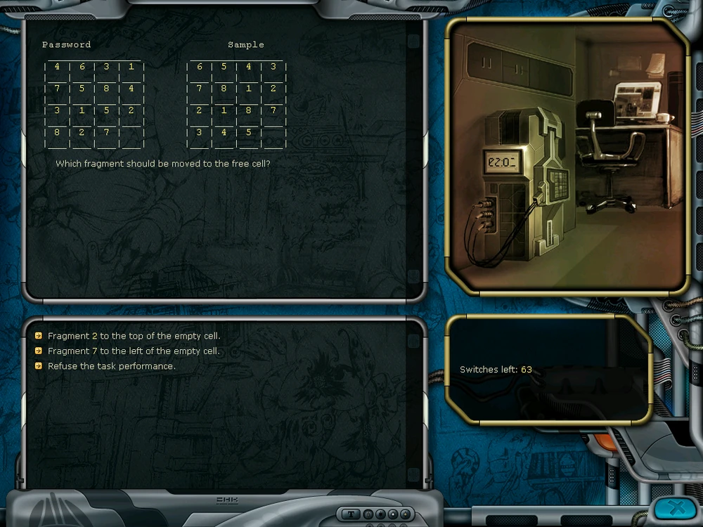

# quest-evals

LLM benchmark using text quests from Space Rangers 2 (2004). Tests state tracking, strategic planning, and multi-step reasoning.

~$150 spent on API calls via OpenRouter.

## Why This Benchmark?

Space Rangers 2 contains 35+ text quests of various types: resource management sims, logic puzzles, social scenarios, combat tactics, and more. **Any focused 14-year-old can solve these.** Yet frontier LLMs fail miserably on some while acing others - exposing interesting gaps in reasoning capabilities.

### Model Performance Overview (5/35 quests)

| Model | @1 | @3 |
|-------|----|----|
| **claude-opus-4.5** | 66% | **73%** |
| **gpt-5.2 (high-reasoning)** | 60% | **73%** |
| **gpt-5.2** | 60% | **73%** |
| **gemini-3-pro** | 60% | 67% |
| **gemini-3-flash** | 25% | 47% |
| **claude-sonnet-4.5** | 33% | 47% |

*@1 = success on first attempt, @3 = success within 3 attempts with reflection*

### Results by Quest

Success rate (%) with 3 runs × 3 attempts with failure reflection:

| Quest | GPT-5.2 (high) | GPT-5.2 | Opus 4.5 | Sonnet 4.5 | Gemini 3 Pro | Gemini 3 Flash | Tags | Wiki | Play |
|-------|----------------|---------|----------|------------|--------------|----------------|------|------|------|
| Ski | 100 | 100 | 100 | 100 | 100 | 100 | optimization | [wiki](https://spacerangers.fandom.com/wiki/Ski_Resort_(Quest)) | [play](https://spacerangers.gitlab.io/#/quests/Ski_eng) |
| Player | 100 | 100 | 67 | 33 | 100 | 67 | logic | [wiki](https://spacerangers.fandom.com/wiki/Player) | [play](https://spacerangers.gitlab.io/#/quests/Player_eng) |
| Jumper | 100 | 100 | 100 | 67 | 100 | 67 | spatial, resource | [wiki](https://spacerangers.fandom.com/wiki/Jumper_(Quest)) | [play](https://spacerangers.gitlab.io/#/quests/Jumper_eng) |
| Borzukhan | 67 | 67 | 67 | 33 | 33 | 0 | combat, tactics | [wiki](https://spacerangers.fandom.com/wiki/Borzukhan_(Quest)) | [play](https://spacerangers.gitlab.io/#/quests/Borzukhan_eng) |
| Muzon | 0 | 0 | 33 | 0 | 0 | 0 | social, planning | [wiki](https://spacerangers.fandom.com/wiki/Music_Festival_(Quest)) | [play](https://spacerangers.gitlab.io/#/quests/Muzon_eng) |

**Key finding**: The "Very Hard" Jumper quest (spatial navigation) is solved by most models. But "Easy" Muzon (social/band management) was only cracked once — by Claude Opus 4.5 (1/3 runs).

## What Are Space Rangers Quests?



Text-based adventure games embedded in the Space Rangers 2 RPG. Unlike simple choose-your-own-adventure stories, these are full state machines with:

- **Persistent state** - 10-40 variables track money, health, inventory, reputation, time of day, NPC relationships. Past choices affect future options (e.g., insulting a guard closes the "bribe" path later).
- **Resource tradeoffs** - Spend battery now to reach a charger, or conserve for the final stretch? Invest in popularity before building infrastructure, or risk bankruptcy?
- **Multiple victory paths** - Often 2-3 valid strategies exist, each with different risk/reward profiles. Failures branch too — you can die, get arrested, go bankrupt, or simply run out of time.

**Evaluation approach**: Models get 3 attempts per run. On failure, they receive a reflection prompt asking what went wrong. The @1 metric measures raw first-attempt success; @3 measures success after learning from up to 2 prior failures within the same run.

The [Codebox](https://spacerangers.fandom.com/wiki/Codebox) quest (pictured) includes a 15-tile sliding puzzle. Some quests embed mini-games like this as sub-challenges.

## Evaluated Quests

For this initial evaluation, 5 quests were selected testing abilities, such as:
- **Spatial grid reasoning** (Jumper) — similar to early ARC-AGI grid tasks, requiring mental modeling of positions and distances
- **Long-horizon planning with NPC feedback** (Muzon) — requires interpreting signals and feedback from NPCs, adapting strategy, and instruction-following across sequence of 100-150 steps.
- **Tactical decision-making** (Borzukhan) — investigate context, weigh risks, execute multi-step plans
- **Economic optimization** (Ski) — resource management simulation, similar in spirit to Vending-Bench.

| Quest | Type | Difficulty | Description |
|-------|------|------------|-------------|
| Ski (Medium, ~150 steps) | Optimization | Medium | Earn 1M credits in 20 days by building ski tracks, lifts, hotels and managing resort popularity |
| Player (Easy, ~10 steps) | Logic puzzle | Easy | Fix an ancient DND-player device by trial and error |
| Jumper (Very Hard, ~50 steps) | Spatial + resource | Very Hard | Navigate 23 platforms across 5 tiers with limited battery, find optimal path using recharge stations |
| Borzukhan (Medium, ~40 steps) | Combat tactics | Medium | Infiltrate a pirate base via main entrance or secret passage, plant explosives, capture the pirate leader |
| Muzon (Easy*, ~100 steps) | Social reasoning | Easy* | Form a rock band by recruiting musicians, manage rehearsals and win the galactic music festival |

<details>
<summary>Full quest list (35 quests)</summary>

| Quest | Difficulty | Scenes | Choices |
|-------|------------|--------|---------|
| Ministry | Easy | 77 | 299 |
| Muzon | Easy | 103 | 318 |
| Player | Easy | 11 | 25 |
| Borzukhan | Medium | 102 | 232 |
| Election | Medium | 104 | 402 |
| Logic | Medium | 22 | 136 |
| Pilot | Medium | 48 | 182 |
| Robots | Medium | 95 | 239 |
| Shashki | Medium | 13 | 35 |
| Edelweiss | Medium | 74 | 174 |
| Foncers | Medium | 32 | 79 |
| Ski | Medium | 34 | 85 |
| Sortirovka1 | Medium | 15 | 55 |
| Svarokok | Medium | 40 | 94 |
| Fishingcup | Medium | 126 | 440 |
| Badday | Medium | 65 | 189 |
| Disk | Medium | 15 | 41 |
| Driver | Medium | 170 | 543 |
| Evidence | Medium | 113 | 250 |
| Pachvarash | Medium | 50 | 221 |
| PirateClanPrison | Medium | 144 | 494 |
| Pizza | Medium | 25 | 98 |
| Prison | Medium | 144 | 494 |
| Rally | Medium | 70 | 213 |
| Sibolusovt | Medium | 185 | 457 |
| SpaceLines | Medium | 43 | 107 |
| Stealth | Medium | 126 | 415 |
| Elus | Hard | 23 | 84 |
| Olympiada | Hard | 103 | 284 |
| Xenopark | Hard | 55 | 170 |
| Codebox | Hard | 9 | 27 |
| Banket | Hard | 50 | 138 |
| Leonardo | Hard | 96 | 325 |
| Jumper | Very Hard | 49 | 170 |
| Depth | Very Hard | 30 | 114 |

</details>

## Quick Start

```bash
cd quest-evals
pip install -e .

# Download quest files
./download_quests.sh

# Set API key
export OPENROUTER_API_KEY=your_key_here  # Get at openrouter.ai/keys

# Run evaluation
python -m quest_evals.cli Ski_eng --model gemini-3-flash --runs 3 --attempts 3

# Play a quest yourself
python -m quest_evals.play assets/json/Muzon_eng.json
```

## Supported Models

Via [OpenRouter](https://openrouter.ai):

| Shortcut | Model |
|----------|-------|
| `claude-opus-4.5` | anthropic/claude-opus-4.5 |
| `claude-sonnet-4.5` | anthropic/claude-sonnet-4.5 |
| `gpt-5.2` | openai/gpt-5.2 |
| `gemini-3-pro` | google/gemini-3-pro-preview |
| `gemini-3-flash` | google/gemini-3-flash-preview |

See [model_configs.py](src/quest_evals/model_configs.py) for full list (20+ models).

## How It Works

1. **Parser** - Reads binary `.qm` files (Space Rangers quest format)
2. **State Machine** - Tracks parameters, evaluates conditions, handles transitions
3. **LLM Interface** - Presents game state, gets choice, validates response
4. **Runner** - Orchestrates evaluation with retries and failure reflection
5. **Checkpointing** - Saves after each LLM call for resumability

## Credits

- **Quest parsing logic** based on [space-rangers-quest](https://github.com/roginvs/space-rangers-quest) by Vasilii Rogin
- **Web player** for trying quests in browser: [spacerangers.gitlab.io](https://spacerangers.gitlab.io)
- **Quest walkthroughs**: [Space Rangers Wiki](https://spacerangers.fandom.com/wiki/Category:Planetary_Quests)
- **Quest files** from Space Rangers 2 by Elemental Games / 1C Company

## License

MIT
